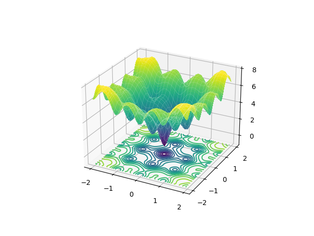

# Abstract
This repository presents a real-coded genetic algorithm using JGG as the transgenerational model and AREX as the crossover method.

# Optimization Problem
The optimization problem shall be the minimization problem in the two-dimensional Ackley function shown below.

# Optimization Result
The convergence process is shown. It can be confirmed that the convergence is toward the optimal solution (0,0).

# References
[Proposal and Evaluation of Adaptive Real-coded Crossover AREX](jstage.jst.go.jp/article/tjsai/24/6/24_6_446/_pdf)
